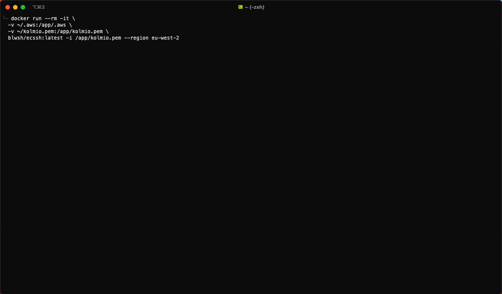

# ECSSH 




Elastic Container (Service) SSH - Allows you to easily navigate running containers in your ECS clusters using one simple command.

# Requirements

* AWS CLI - https://github.com/aws/aws-cli

# Installation

Check releases page.

### Usage

```shell
ecssh --region "<region>" --cluster "<cluster name or ARN>"
```

### Flags

| Name    | Optional  | Description                           |
|---------|-----------|---------------------------------------|
| region  | ✔️        | The aws region of the cluster(s).     |
| cluster | ✔️        | The cluster to search for containers. |
